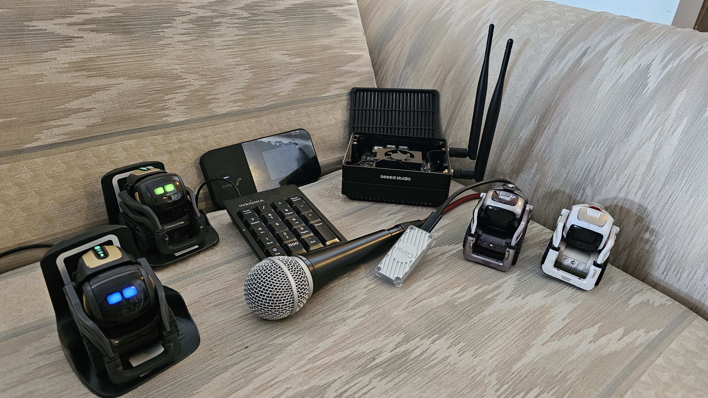
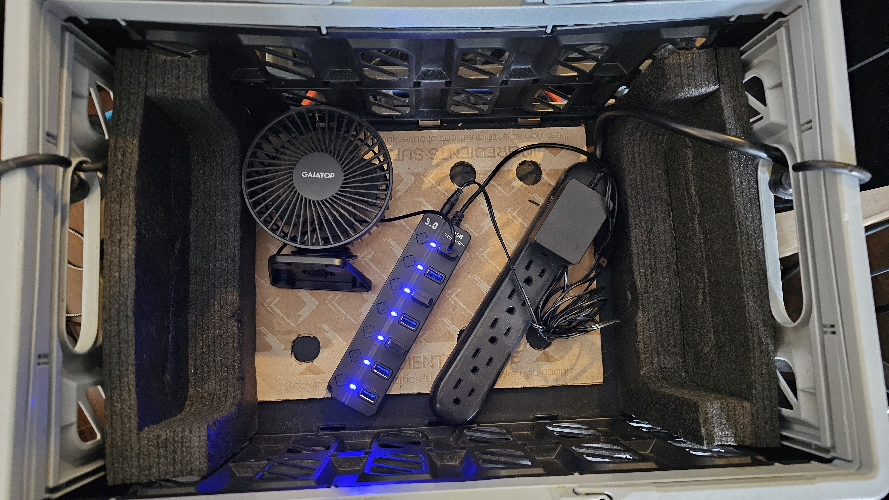
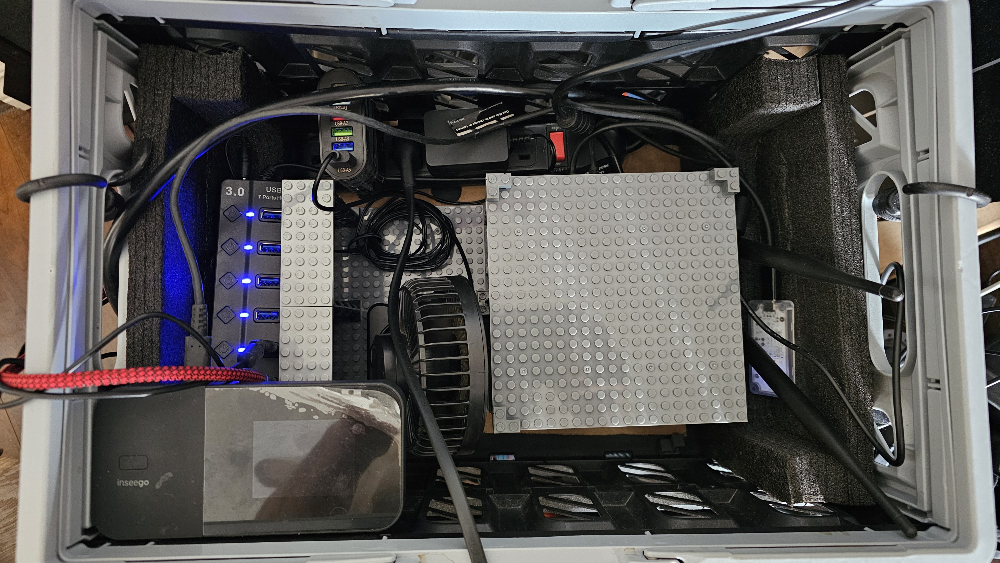
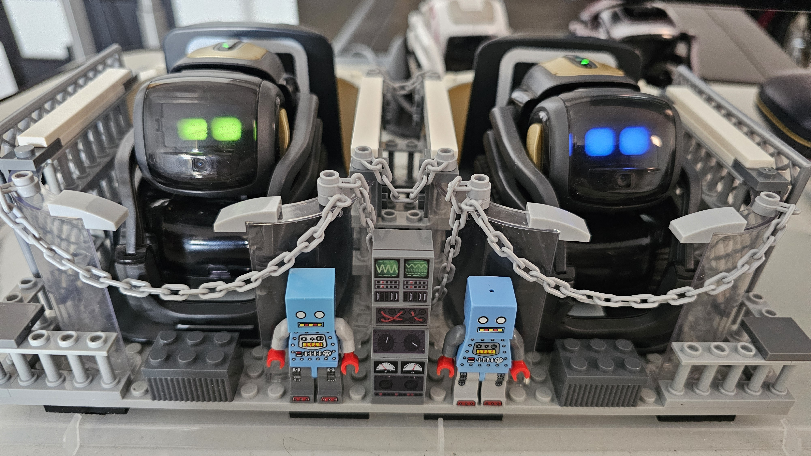

# GOPOD Mobile

> A complete AI robotics session platform on a 2-wheel dolly.  
> Roll in. Power on. Run a session.

*The physical rig below is Wire-Pod layer — built, real, self-powered, local-network-only,
no internet required, room to vehicle to park. "Session"/venue/audience language throughout
this page is GOPOD layer (Point B — not built yet): live multichat interaction with real
people. Marked section by section below.*

---

## What travels with GOPOD

Two crates. One dolly. Everything needed for a live session. *(GOPOD layer — not built yet.)*

```
Crate 1 — Compute
├── Jetson Orin NX 16GB ← local AI, Wire-Pod, orchestration
├── T560 laptop     ← operator console, development
├── Anker Solix C1000  ← battery backbone
├── mobile modem    ← internet uplink when wanted
├── network gear    ← local Wi-Fi for robots and operator
├── Coral Edge TPU  ← local vision inference
└── cables, hubs, SSDs

Crate 2 — Robots
├── Brobot 1 (vector1 / 0dd1b9e9)
├── Brobot 2 (vector2 / 0dd1d8bf)
├── Cozmos
├── chargers
└── cameras / mics
```

**Proof — the full kit, out and running.**


**Photo:** inside one crate, packed — fan, USB hub, power bar.


**Crate 2, stage 2 — scaffolding, then the harness.** Interior build-out first: Lego
baseplates scaffold the crate, 7-port USB hub, fan, cabling, Inseego hotspot tucked in the
corner.


Then the brobots' own Lego mobile-GOPOD harness sets on top of that scaffolding — Doc
(green eyes) and Pip (blue eyes) seated in place.


**Photo coming.** Both crates, packed down and closed — how small the whole kit collapses to for transport. The shot this page is actually waiting on.

Roll in. Open lids. Power on. Session starts. *(GOPOD layer — not built yet.)*

---

## Three networking modes

GOPOD defaults to boring. Boring works.

**Mode A — Offline (default demo mode)**  
No internet. Nothing in the cloud. Everything runs locally.
- Wire-Pod on Jetson
- Ollama on Jetson
- Vosk STT on Jetson
- Kokoro TTS on Jetson
- Robots connect to local 2.4 GHz

This is the most reliable demo mode. It also works in a basement, a moving car, a park, or anywhere else with no signal.

**Mode B — Mobile internet**  
LTE/5G hotspot or mobile modem adds:
- cloud APIs
- livestreaming
- GitHub push
- Claude / ChatGPT as optional layers

Internet enhances the session. It is not the engine.

**Mode C — Venue Wi-Fi**  
Restaurant, café, library, hackerspace — connect and run. Local-first stack still handles everything. Venue internet is a bonus, not a dependency. *(The venue-connect scenario is GOPOD layer — not built yet; the local-first stack itself is Wire-Pod layer, real.)*

---

## Where it deploys

GOPOD has been designed and tested for real-world conditions, not ideal ones — the rig
itself: self-powered, local wifi only, no internet, no wall outlet required.

### GOPOD layer (Point B — not built yet): where this could go

Multichat, live audience interaction, and venue booking are not built. The table below is
the roadmap for where the finished experience could run once that layer exists — not a
claim that it runs there today.

| Venue | Notes |
|-------|-------|
| Back seat of a moving car | Battery + hotspot. Full session. No outlet needed. |
| Parked vehicle | Fastest setup. Everything stays assembled between stops. |
| Restaurant or café | Table space, power outlet optional. Robots stay contained. |
| Bar or comedy venue | Live audience. Robots run, audience reacts. |
| Makerspace / hackerspace | Existing infrastructure. Connect and extend. |
| Convention or expo | Instant demo station. Roll in, unpack, run. |
| Classroom or library | Educational deployment. Offline-capable. |
| Outdoor / public space | Battery mode. No venue required. |
| STEM event | Bring the full stack. Show the engineering. |

The venue supplies the audience. GOPOD supplies everything else.

---

## Power modes

**Internal battery (Anker Solix C1000)**  
Runs the Jetson, networking, monitors, and chargers independently. No outlet required.

**Vehicle power**  
Inverter or 12V/USB-C PD. Charge and operate while driving. Arrive with a full battery.

**Shore power**  
Plug into any outlet. Run indefinitely. Hotel, community centre, convention floor — same setup, same session. *(The named venues and "session" framing are GOPOD layer — not built yet; unlimited runtime on shore power itself is Wire-Pod layer, real.)*

---

## What one deployment produces

A single outing isn't just a demo. It feeds the whole pipeline.

- Live session proof *(GOPOD layer — not built yet)*
- Video clips and B-roll
- Livestream content
- Website article
- SEO content
- Newsletter material
- GitHub commits
- Social posts
- Documentation

One trip out. Multiple outputs. The dolly pays for itself. *(GOPOD layer — not built yet: no revenue has been earned from a real deployment.)*

---

## The offline-first doctrine

Cloud AI is optional. The session belongs to GOPOD.

The provider supplies text. The internet is not the engine.

This matters because venue networking can't be assumed. A restaurant guest network, a school firewall, a convention Wi-Fi that's overloaded — none of those kill the session. The Jetson handles it locally and Wire-Pod never notices.

---

## The vehicle as a staging area

The car isn't just transportation.

- Robots stored, charged, and ready
- Jetson pre-booted before arrival
- Networking already up
- Session pre-loaded *(GOPOD layer — not built yet)*
- Arrive and demo within minutes *(GOPOD layer — not built yet)*

**Photo coming.** The dolly, crates loaded, rolling out of the vehicle — how fast the kit goes from parked to staged. The shot this page is actually waiting on.

Parked vehicle operation is one of the cleanest deployment modes. Everything stays assembled. Setup time is near zero. *("Deployment mode" here is the GOPOD-layer scenario above — not built yet; the vehicle-staging mechanics themselves are Wire-Pod layer, real.)*

---

## Portable AI production, not portable hardware

Early framing: *a portable robotics setup.*

Current reality: a portable AI session, production, and development platform. *("Session" is GOPOD layer — not built yet; production and development are Wire-Pod layer, real.)*

From the same crates, in the same deployment, GOPOD can:

- run a live robot interview
- develop and test new session cards
- capture livestream footage
- push code to GitHub
- generate website content
- demonstrate offline AI to a room of people who have never seen it *(GOPOD layer — not built yet)*

The dolly rolls. The entire operation moves with it.

---

## Current state

Offline session stack: confirmed working on Jetson.  
Two-robot interview: fires from an operator-run command (`pha0b interview`), not a voice trigger.  
Battery operation: Anker Solix C1000 in kit.  
Mobile networking: modem + local Wi-Fi separation confirmed.  
Field deployment: in active use. *(GOPOD layer — not built yet; the rig's portability is confirmed, real-venue/audience deployment is not.)*

---

> From Doctrine Barfallonyou
> Lesson! The lab goes where you go.
> Boom! Done! Class Dismissed!
> — Doc Squawkadoodle

---

## GOPOD YAHMM (You Are Here Mall Map)

Part of GOPOD — see [tech/README.md](README.md) for everything else in this folder, or [the root map](../README.md) for the rest of GOPOD.
